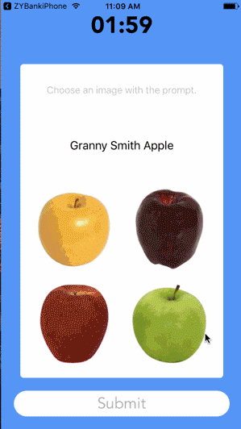

# Quiz - Lingochamp interview project.（流利说面试项目Quiz）

Snapshot:

We want to build this quiz in-house.

The grocery challenge is simple:

1. Applicant clicks Start Quiz. They have 2 minutes to finish the quiz.
2. Applicant is presented with a prompt and 4 images. They need to select the image that corresponds with the prompt and press submit.
3. Applicant is presented with next question, until all questions have been answered or 2 minutes is up.
4. Applicant sees their final score at the end. They should have an option to retake the challenge (for testing).

Quiz Requirements

1. Applicant should see one question at a time.
2. Applicant should see the prompt and 4 images.
3. Applicant can choose an image, then hit submit to save their answer. Applicant can change their answer before hitting submit.
4. Questions should be shown in random order.
5. Answers should be shown in random order.
6. Quiz does not need to work landscape.
7. Answers to individual questions should be stored per applicant.
